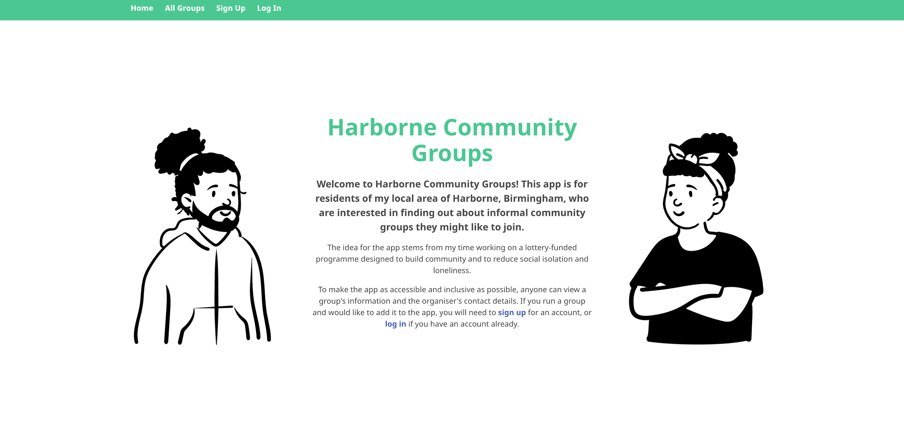
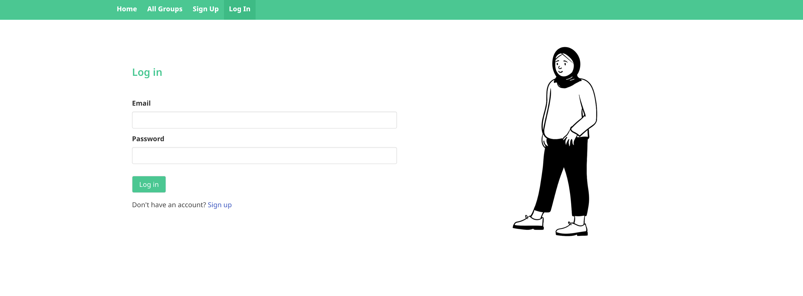
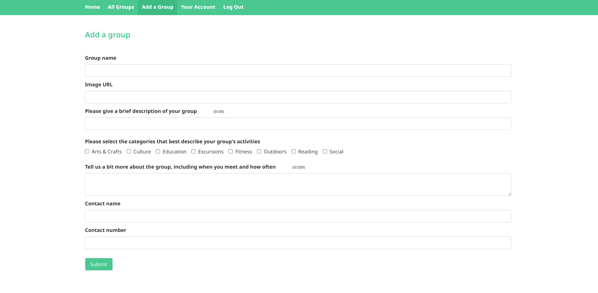

# General Assembly Project 4: Harborne Community Groups

## Description

At the end of the fourth and final module of my General Assembly bootcamp, I worked solo to build a full-stack application, making my own frontend and backend. I used a Python Flask API with Flask REST framework to serve my data from a Postgres database. I built a separate frontend with React. I had 8 business days (12 available in total) to complete the project.

You can find my deployed project [here](https://harbornecommunitygroups.netlify.app).

Please feel free to sign up to explore the full deployed project (using dummy details if you prefer). You will be able to delete your account when you’re done!

## Getting Started/Code Installation

Clone both the frontend and backend repos

**Backend**

- Make sure you have Python 3.12, pip, pipenv and PostgreSQL installed
- Run `pipenv install` and then `createdb groups_db`
- You will need to create a `.env` file containing the following:

```
    FLASK_ENV=development
    FLASK_SKIP_DOTENV=1
    FLASK_RUN_PORT=4000
    FLASK_DEBUG=1
```

- To seed the database, run `pipenv run python seed.py`
- To start up the backend server, use `pipenv run flask run`

**Frontend**

- Make sure you have [Node.js](https://nodejs.org/en/download) installed
- Run `npm install`
- You will need to create a `.env` file containing the following: `VITE_APP_URL=/api`
- To start the frontend server, it’s `npm run dev`

## Technologies Used

- VS Code
- Git / GitHub
- Node.js
- Vite
- TypeScript / TSX
- React
- React Router
- Bulma
- CSS
- Google Fonts
- Python
- Flask
- SQLAlchemy
- Marshmallow
- PostgreSQL
- Insomnia
- TablePlus
- Netlify
- Heroku

## Brief

- Build a full-stack application by making your own backend and your own frontend.
- Use a Python Flask API with a Flask REST Framework to serve your data from a Postgres database.
- Consume your API with a separate frontend built with React.
- Build a complete product with multiple relationships and CRUD functionality.
- Implement thoughtful user stories/wireframes.
- Deploy your project online so it's publicly accessible.

## Planning

I decided to build an app that would enable members of my local community to find out about informal groups they might like to join in the area. This stemmed from my time working on a lottery-funded programme designed to reduce social isolation and loneliness. To plan, I made a thorough [wireframe including user stories, plus an ERD for my models](https://github.com/CatherineBrett/project-4-frontend/blob/main/wireframe/wireframe-and-models.png).

## Build/Code Process

I began by committing the initial starter code to my frontend and backend repos, and then got the ball rolling by creating some of the backend’s skeleton, installing some dependencies, and beginning work on my `app.py` and group model.

Having reflected, I decided it would make my other models simpler and my code dryer to create a base model. I also realised that having never used many-to-many relationships before, I had made a mistake in including categories columns in my group model, so I corrected this while also amending it to extend the base model.

I then wrote my user, category, and association group category models. With the models in place, I was able to move on to my seed file and check that everything was working as expected. I created a user, a group, a couple of categories and the associated group categories, and after creating my database and checking I could see it in TablePlus, I successfully seeded it.

Next, I added all the serializers and began my groups controller, writing the first endpoint to get all the groups. I tested this in Insomnia to confirm that it was working.

To get more familiar with many-to-many relationships, I took some time out to watch a recorded lecture on the subject, and then continued with my groups controller, writing and testing all my endpoints.

For my users controller, I got my signup endpoint working, and then introduced password hashing to the model and a login endpoint which returned a token (or failed, as appropriate). I updated my seeding so that my user had a real password instead of a fake hash, and reseeded to check that the password had been successfully hashed and saved to the users table in the database. I added and tested endpoints for updating and deleting a user (minus permissions for now), and fleshed out my seed file so that on reseeding there would always be the right data to demo the app – extra users including an admin, 8 categories (see below), 8 groups, and the associated group categories.

```py
categories = [
    CategoryModel(name="Arts & Crafts"),
    CategoryModel(name="Culture"),
    CategoryModel(name="Education"),
    CategoryModel(name="Excursions"),
    CategoryModel(name="Fitness"),
    CategoryModel(name="Outdoors"),
    CategoryModel(name="Reading"),
    CategoryModel(name="Social"),
]
for category in categories:
    category.save()
```

Now that many of the basics were in place on the backend, I moved on to the frontend. I began by:

- Installing packages and spinning it up locally
- Beginning my `App.tsx` and adding most routes
- Making my initial `Navbar` component and adding the majority of the links
- Creating files for most of the other components I would need
- Making an `IGroup` interface, a `Group` component and a `GroupsList` component
- Successfully fetching from the get all groups endpoint and rendering all 8 groups on the page
- Updating my seeding to change an image and the length of the `brief_desc` fields (a character limit in the appropriate components would later manage this)

I then wrote a `Category` component to render the categories via a `ShowOneGroup` component, plus an `ICategory` interface. For my `SignUp` component, on the backend I added a password confirmation to my signup endpoint, and then created a form on the frontend. I tested this by signing up a new user via the form and checking that my database had updated accordingly. My login page followed, and again I tested this to check I was getting a token in local storage and being navigated to the home page. I began and briefly parked the more complex `AddGroup` component, and then created my secure route, adding it as a decorator to the other routes that required it. I then returned to my `AddGroup` component, and, temporarily commenting out the Category `<select>` element, checked that I was able to submit the rest of the form.

Next, I revisited the backend to add permissions, validation, error handling, custom validation on passwords etc. Having made changes, I retested my endpoints and found that delete user was no longer working. I spent a good while trying to figure out where it was failing, printing line numbers to the console to help establish precisely which line the code was failing on. It turned out to be `user_to_delete.remove()`. I was advised that this was likely to be due to a user’s relationship to groups – that deleting a user would leave a group without an owner, which was a requirement. Trying `cascade="all, delete"` didn’t fix the issue, so I made a note to come back to it later on.

Before leaving the backend, I made a `get_current_user` handler, and then returned to the frontend to add user/visitor views, edit/delete buttons for a group’s creator, the ability to log out, and a work-in-progress Your Account page.

Having reflected on the many-to-many relationship, it was now time to tackle the `create_group` handler and `AddGroup` component (see Challenges/Wins below)!

Once the `AddGroup` component was up and running, I used this as a template for an `EditGroup` component, which pre-populated the update form after fetching an existing group by its ID:

```
useEffect(() => {
    async function fetchGroup() {
        const resp = await fetch(`${baseUrl}/groups/${groupId}`);
        const groupData = await resp.json();
        const groupToEdit = {
            name: groupData.name,
            image: groupData.image,
            brief_desc: groupData.brief_desc,
            full_desc: groupData.full_desc,
            contact_name: groupData.contact_name,
            contact_number: groupData.contact_number,
            categories: groupData.categories.map((item: any) => {
                return item.category.name;
            }),
        };
        setFormData(groupToEdit);
    }
    fetchGroup();
}, []);
```

Next, in order to be able to delete a group, I first filtered out the group categories with that group’s ID and deleted them from the database. This then allowed the group itself to be removed. This logic would later help me when trying to solve the delete user problem I’d parked earlier.

I gave the admin user the permission to delete (but not edit) any group.

I moved on to some styling, and added in-built browser validation to the various forms, as well as an early return on the Create/Edit Group forms to prevent a user submitting the form if they had not selected any categories. (This needed handling differently to the text inputs, which could simply be given the `required` property.) I then updated the Your Account page to display the user’s username and email, plus the option to delete their account (see Challenges/Wins).

I added some copy to the home page to explain what the app was for and how to use it, and then moved on to error handling. As usernames have to be unique, I added some logic to the `sign_up` handler to manage this: I made a variable, `username_taken`, by looking up the first – which, if present, would also be the only – user in the database with the same username that the new user was attempting to sign up with. If nothing was found, `username_taken` would be falsy so no error would be produced. If the proposed username was present in the database, I returned “Username not available” and the form could not be submitted.

```py
username_taken = (
    db.session.query(UserModel)
    .filter_by(username=user_dictionary["username"])
    .first()
)

if username_taken:
    return {"message": "Username not available"}, HTTPStatus.CONFLICT
```

I removed the Your Account (ergo delete account) page from the admin user’s logged-in view, as there would be no use case for deleting their account.

Further to the placeholder “early return” implemented previously, I now added proper error handling in case a user leaves the categories checkboxes blank on the Add/Edit Group forms:

```py
if len(categories_list) == 0:
    return {"message": "Please check you have completed all questions and try again"}, HTTPStatus.UNPROCESSABLE_ENTITY
```

I also ensured that error messages cleared once a user made changes to the field in question, using React’s `useState` Hook inside the `handleChange`/`handleCheckboxChange` functions, to set the `errorData` back to an empty string.

I added character counts to the two description fields on the Add/Edit Group pages, again using React’s `useState` Hook to update them inside the `handleChange` function. For Edit Group, after an initial state of 0, once the existing group has been fetched and the fields pre-populated for the user, the counts are set to the correct length (until the user changes them, if applicable):

```
setFormData(groupToEdit);
setBriefDescCharCount(groupToEdit.brief_desc.length);
setFullDescCharCount(groupToEdit.full_desc.length);
```

Lastly, I finished styling the app, changed its browser tab title, and fixed some types in order to redeploy ahead of my demo.

## Challenges/Wins

Figuring out the logic for creating a group was a particular challenge as the submission of one form to create one group involved multiple models and types of relationships. Many-to-many relationships weren’t something we’d really covered in class, so to get my head around it I examined example code, watched a recorded lecture, read about it online, talked it through with more experienced engineers, and spent some time thinking it through away from my computer, which I often find useful when problem-solving as it helps me to picture things conceptually, even spatially, without the detail of the code itself in front of me.

In the end, I saved the categories array in a variable and then deleted it from the main `request.json`. I added the current user’s ID to the remaining json before deserializing and saving it as an instance of the group model. I then looped through the list of categories, and for each category present, looked it up in the database, paired the new group’s ID with the category’s ID, and saved this to the database as an instance of a group category model. I was then able to return a jsonified version of the new group, complete with a populated categories field.

```py
def create_group():
    group_dictionary = request.json

    try:
        categories_list = group_dictionary["categories"]
        del group_dictionary["categories"]

        #snip...

        group_dictionary["user_id"] = g.current_user.id
        group_model = group_serializer.load(group_dictionary)
        group_model.save()

        for category in categories_list:
            req_category = (
                db.session.query(CategoryModel).filter_by(name=category).first()
            )
            group_category_model = GroupCategoryModel(group_id=group_model.id, category_id=req_category.id)
            group_category_model.save()

        return group_serializer.jsonify(group_model)
```

Lastly, I got the frontend working by adding each selected category – a string – to the initially empty “categories” array of strings. At this point, as the dropdown was not behaving quite as I expected it to, I replaced it with checkboxes for (in my opinion!) a more attractive page and a better UX. For this, I added a `handleCheckboxChange` function which added or removed categories from the array based on whether the box was ticked/unticked.

Allowing a user to delete their account was similarly complex as multiple models/tables were involved, and a user’s relationship to groups and group categories meant that they could not (and should not) be deleted in isolation. To work through it, it was necessary to deal with each constituent part step by step. I first looked up the groups created by the user, and put them in a list. I then mapped through the list, and looked up the group categories attached to each of those groups. Deleting the group categories allowed me to delete the groups, and deleting the groups allowed me to delete the user.

```py
try:
    user_to_delete = db.session.query(UserModel).get(user_id)

    if not user_to_delete:
    return {"message": "User not found"}, HTTPStatus.NOT_FOUND

    if user_to_delete.id != g.current_user.id:
    return {"message": "You are not authorised to delete this account"}, HTTPStatus.UNAUTHORIZED

    groups_to_delete = db.session.query(GroupModel).filter_by(user_id=user_to_delete.id)

    for group in groups_to_delete:
        groups_categories_to_delete = db.session.query(GroupCategoryModel).filter_by(group_id=group.id)
        groups_categories_to_delete.delete()

    groups_to_delete.delete()

    user_to_delete.remove()
    return "", HTTPStatus.NO_CONTENT
```

On the frontend I included a `<p>` tag underneath the delete button to warn a user that deleting their account would also delete all groups associated with their account.

Another challenge I faced was resisting the urge to try and include too many features in my project, or to rush to attempt stretch goals, to the detriment of an MVP. My priority was always to consolidate what I had learned while producing a simple, decently polished app with a minimalist look, a realistic use case, and robust functionality. I think I achieved this, and am happy with the overall UX/UI. Here are some screenshots:








## Key Learnings/Takeaways

With this project, I felt a shift in my confidence around what I think of as the more traditional “IT” side of programming – running scripts, installing packages, spinning up servers etc. At the beginning of the bootcamp these elements felt quite daunting, but with practice I now find I am much more comfortable and able to figure things out, rather than relying on someone else’s instructions and just blindly following them with my fingers crossed!

I also got more used to using my dev tools to inspect elements when things weren’t doing what I was expecting styling-wise!

In addition, I really enjoyed using the Python I had learned from scratch in the few days prior to embarking on the project. I look forward to learning more Python, and I have some books, podcasts and YouTube channels lined up to explore in the coming weeks.

I also noticed that I had more of a natural interest in the backend, like with Project 3 (Bootcamp Buddy). I will be interested to see if this preference persists now that it is up to me to choose where to focus my learning beyond the bootcamp!

## Bugs

- There is something about the Italian Conversation Group that takes it slightly longer to load than the others on the All Groups page. I suspect it is the file size of the image.

- At certain screen sizes, the cards are not exactly the same size as each other.

- Because the app is not fully responsive, the logout button disappears when in portrait mode on mobile.

## Future Improvements

With more time, improvements and additions I would make to my project include:

- Fixing the bugs above

- Tidying up and refactoring some of the code, as well as adding comments in places

- Allowing a user to update, rather than just delete, their account

- Giving a user an All Your Groups page, where they could read, update or delete any group they had created, without having to find it on the All Groups page first

- Including a search bar on the All Groups page where users could search for keywords/categories/group creators etc.

- Giving the admin user the ability to delete any other user

- Unit testing